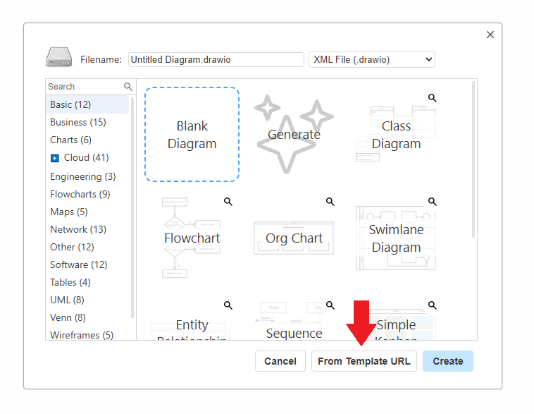

# Problem 4 – OAuth2 Authentication flow

Draw how the authentication flow of a system using OAuth2 (JWT-based) communicates from the front end to the backend. Feel free to use any diagramming tool of your choice, we recommend using Draw.io.

A drawio template file has been provided in the repository that can be loaded via url: [Copy URL](https://raw.githubusercontent.com/Sh3rlck/topodot.technical-interview-problems/refs/heads/master/src/Problem-4-OAuth2-Flow/Question%204%20Template.drawio)

Questions:
* How should jwt token be stored in the client side? 
* What are the pros and cons of using the specified storage option?
