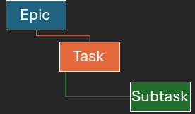

# Problem 5 – Project Database Schema (Bonus)

Design a relational database schema for a simplified task-management system (like Jira) with the following requirements:

***Item**: a database row that could be any of the hierarchy levels defined below.

* Schema needs to have three hierarchy levels:

    

* Each item can have multiple items of the level below it. For Example, an Epic can have multiple tasks, and Task can have multiple subtasks.
* Each item at any level can have multiple dependencies. Dependencies are items of the same type that add constraints to the item that owns them. For example, Task A depends on Task B and Task C, meaning, for Task A to start, Task B & C need to be completed.
* Each item of any level needs to be unique.
*  Each item of any level needs to be queried fast and efficiently.
* If an item is deleted, its child items need to be deleted as well.  

